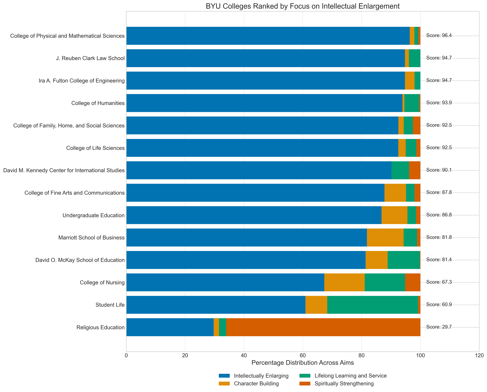
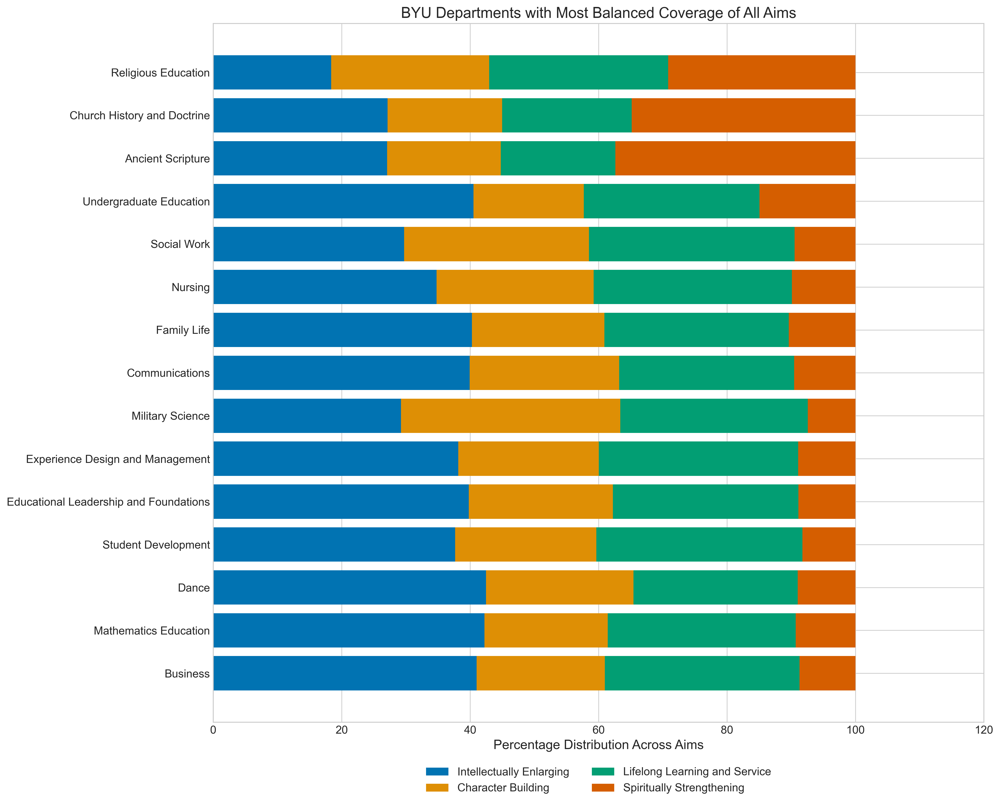

## Current Learning Outcomes Foci and Suggestions for the Future

# TL;DR
* 90.4% of all Learning outcomes from the BYU course catalog are focused on "Intellectually Enlarging".
    * 1.7% focus on "Spiritually Strengthening".
    * 3.5% focus on "Character Building".
    * 4.4% focus on "Lifelong Learning and Service".
* 7 colleges have more than 90% of their objectives on Intellectual Enlargement.
* 42 departments have more than 90% of their objectives on Intellectual Enlargement.

# Context
Brigham Young University operates under a broader charter than traditional universities. 
In addition to fostering intellectual growth, BYU's mission emphasizes four distinct aims: 
a BYU education should be:
1.  Spiritually strengthening,
2.  Intellectually enlarging,
3.  Character building, leading to
4.  Lifelong learning and service.
([Source: Aims of a BYU Education](https://catalog.byu.edu/about/aims-of-a-byu-education))

However, an analysis of course-level learning objectives across the entire BYU catalog reveals that over 90% focus primarily on intellectual development. 
This suggests a meaningful opportunity to better integrate the university's other aims into the classroom experience. 
As Elder Jeffrey R. Holland taught, "BYU will realize President Kimball's vision only to the degree it embraces its uniqueness, its singularity. . . . We must have the will to be different and to stand alone, if necessary, being a university second to none in its role primarily as an undergraduate teaching institution that is unequivocally true to the gospel of the Lord Jesus Christ." 
([Source: The Second Half of the Second Century of Brigham Young University](https://speeches.byu.edu/talks/jeffrey-r-holland/the-second-half-second-century-brigham-young-university/))

# Results

## Distribution of Primary Aims Across All Courses

As shown in the chart above, the vast majority of course learning outcomes at BYU focus primarily on Intellectual Enlargement. This imbalance raises questions about how well the curriculum is addressing the other three aims of a BYU education.

## Colleges Ranked by Focus on Intellectual Enlargement

Some colleges show an almost exclusive focus on intellectual aims, with little emphasis on spiritual, character, or lifelong learning aspects.

## Departments with Most Balanced Coverage of All Aims

The most balanced department, Religious Education, achieved a wholistic score of 98.9, indicating relatively even coverage across all four aims of education.

# Methodology
In order to assess all course learning objectives of current BYU courses we used the course catalog. After finding all 5,916 courses listed there we scraped each URL to extract course name, course title, department, college and all learning objectives. Eighteen courses from this list have been retired, 863 have no learning objectives. The remaining 5,035 courses had learning objectives.

Each of these learning objectives was then classified to evaluate how well it aligns to each of the Aims of a BYU education. The highest score from the 4 candidates is considered the primary aim.

Some objectives cover a variety of aspects of the 4 aims (e.g. PHIL 201 "Students will be able to use philosophical knowledge and skills to solve theoretical, practical, and ethical problems and to integrate philosophical principles with religious and moral convictions.") Most learning objectives are highly focused on "Intellectually Enlarging" aims (e.g. STAT 535 "Demonstrate the application of Gaussian Linear Models for observational studies and designed experiments.).

# Suggestions
1. Departments should review their learning outcomes to ensure they address all four aims of a BYU education where appropriate. We should consider a target of at least 30% non Intellectual Enlargement course objectives at the college level.
2. Course designers might consider adding at least one learning outcome that addresses spiritual strengthening, character building, or lifelong learning/service in courses where these dimensions are relevant.
3. The university could develop guidelines or examples for creating learning outcomes that integrate intellectual learning with spiritual and character development.

# Conclusions
While intellectual enlargement is naturally a primary focus of university education, BYU's distinctive mission calls for greater balance in addressing all four aims. The current strong tilt toward intellectual outcomes suggests an opportunity to better integrate spiritual strengthening, character building, and lifelong learning/service into course design and learning outcome statements.
